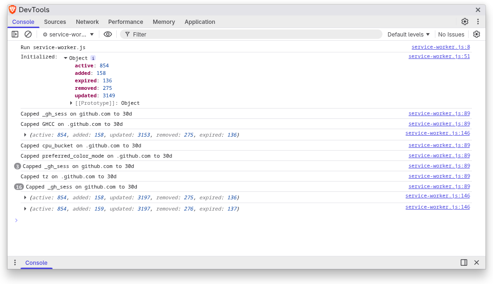

# Cookie Cutter

A Chrome extension that lets you visualize Cookie accesses while you're browsing.

As you browse the web, cookies track you from a million different places.

The extension also lets you accelerate the cookie aging rate which
causes them to drop off sooner.

Instead of letting cookies dictate how long they survive on your system,
you can set a maximum age limit, and all incoming cookies will be forced
to abide by this limit.

So instead of cookies expiring in 3 months or longer, you can force them
to expire after 2 weeks, for example.

You can see the max-age enforcement in the service worker console log.

## Installation

Cookie Cutter is not published to the Chrome Web Store, so it must be loaded as an unpacked extension:

1. Clone or download this repository.
2. Open Chrome or Edge and navigate to `chrome://extensions`.
3. Enable **Developer mode** (toggle in the top-right corner).
4. Click **Load unpacked** and select the repository folder.
5. Click the Cookie Cutter icon in the toolbar to open the side panel.

To update after pulling new changes, click the **Reload** button on the extension card in `chrome://extensions`.

## License

This extension is vibe coded so feel free to take and modify it yourself
using whatever agent you want. In this case, the bulk of the code here
was written by Claude Sonnet 4.6.
