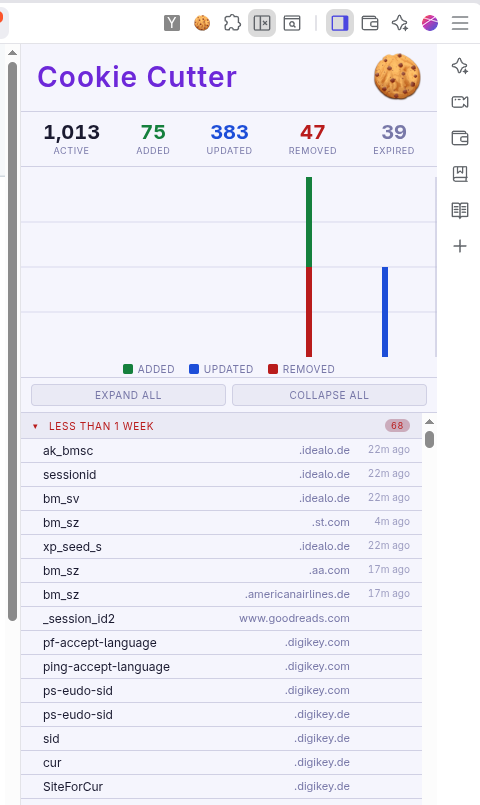

# Cookie Cutter

A Chrome extension that lets you visualize Cookie accesses while you're browsing.

As you browse the web, cookies track you from a million different places.

The idea eventually is to accelerate the cookie aging rate and to cause
them to drop off sooner.

## License

This one is also vibe coded so feel free to take and modify it yourself
using whatever agent you want.
